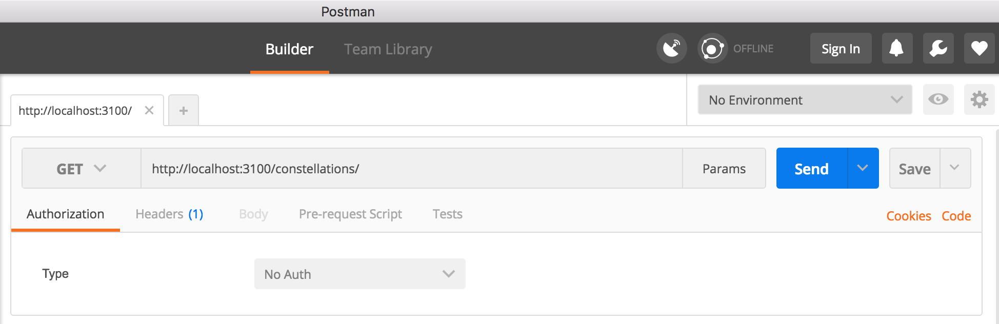
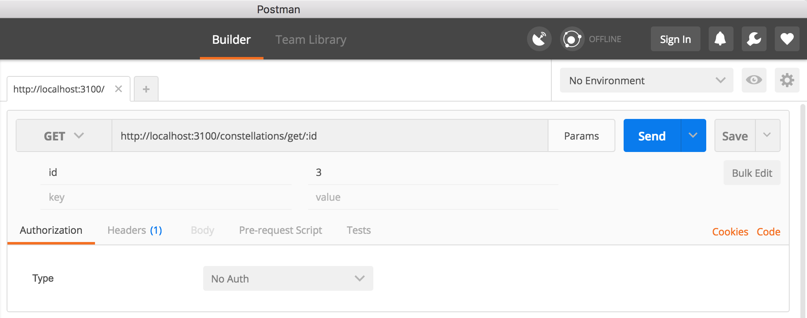
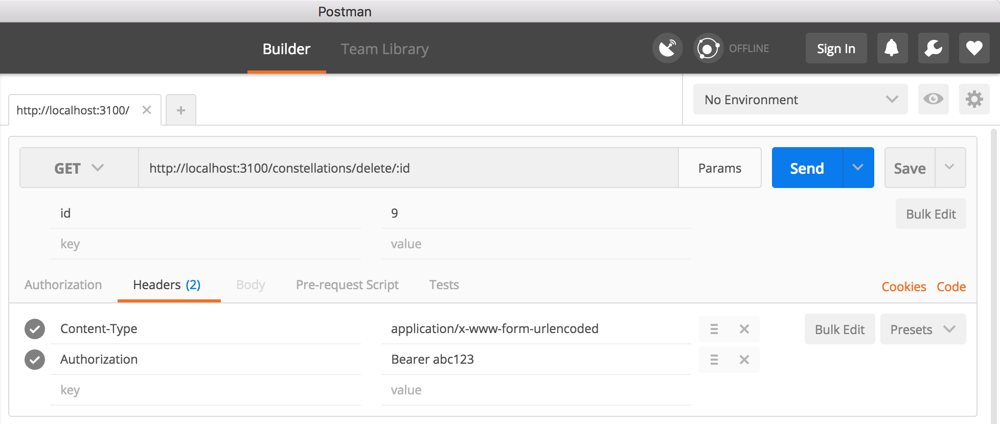

# Express-sequelize-api
Express api boilerplate using sequelize and sqlite3 with bearer auth

## Quickstart

```
$ git clone https://github.com/kathleendaily/express-sequelize-api.git
$ npm install
$ npm start
```
Open your browser at [http://localhost:3100](http://localhost:3100). You should see a welcome message if successful.

## Using Sequelize

### Creating Models

To create a new model for your api (eg. Planet), run the following while in the project dir:
```
$ node_modules/.bin/sequelize model:create --name Planet --attributes name:string,color:string,is_habitable:boolean
```
This will create a new Planet model with the attributes name, color and is_habitable in the /models folder. A migration file for Planet will also be created automatically and placed in the /migrations folder.

### Creating the Database Tables

Once you've created your model(s), you can run the migration to create the tables in the database for you:
```
$ node_modules/.bin/sequelize db:migrate
```
You can check to see that the tables were created correctly in your database by opening a new tab in your terminal and running:
```
$ sqlite3 db.development.sqlite
  sqlite> .tables
```
If done correctly, the table names will be listed on the next line in your terminal.

## Testing your API

The easiest way to test out your API is by downloading the [Postman](https://www.getpostman.com/) app.

### Get all constellations

Once your app is running, go to [http://localhost:3100/constellations/](http://localhost:3100/constellations/) to see a list of constellations retrieved from the sqlite database. You can also do this with Postman by typing that same url using GET and then clicking the Send button.



### Get a single constellation

In Postman, enter the url [http://localhost:3100/constellations/get/:id](http://localhost:3100/constellations/get/:id) and make sure it's set to GET. Click the PARAMS button to the right of the url and enter "id" in the key field, and the value "9" in the value field. Press the Send button, and you should see the Leo constellation outputted below.



### Create a constellation

In Postman, enter the url [http://localhost:3100/constellations/create](http://localhost:3100/constellations/create) and make sure it's set to POST. Click the Body tab and enter "name" as the key, and "Andromeda" as the value. Below the key-value pair you just added, add another key "meaning" with the value "the chained lady". Press the Send button, and you should see the response {"message":"created constellation"} if successful.


### Delete a constellation

This endpoint is a little different - it requires authorization in the form of a Token that you must send to it first. In Postman, enter the url [http://localhost:3100/constellations/delete/:id](http://localhost:3100/constellations/delete/:id) and make sure it's set to GET. Click on the Headers tab and add a new key "Authorization" with the value "Bearer abc123". This allows us to send the token "abc123" (one of the valid tokens already stored in the Users table of the database) so that we can are allowed to delete a constellation. Pressing the Send button should result with the response of {"message": "deleted constellation"} if successful. If the authentication was done incorrectly, then you will receive the response "Unauthorized" instead.


